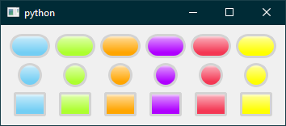
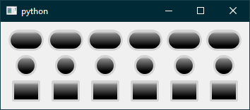

# pyqt_led
Simple LED widget for PyQt5.




## Table of Contents
- [Installation](#installation)
- [Usage](#usage)
- [License](#license)

## Installation
### pip
```
$ pip install pyqt-led
```

### setup.py
```
$ python setup.py install
```

## Usage
The following example is also provided in the package, and will result in the screenshots shown above.
```python
from PyQt5.QtCore import Qt
from PyQt5.QtWidgets import QApplication
from PyQt5.QtWidgets import QGridLayout
from PyQt5.QtWidgets import QWidget
from pyqt_led import Led
import numpy as np
import sys


class Demo(QWidget):
    def __init__(self, parent=None):
        QWidget.__init__(self, parent)
        self._shape = np.array(['capsule', 'circle', 'rectangle'])
        self._color = np.array(['blue', 'green', 'orange', 'purple', 'red',
                                'yellow'])
        self._layout = QGridLayout(self)
        self._create_leds()
        self._arrange_leds()

    def keyPressEvent(self, e):
        if e.key() == Qt.Key_Escape:
            self.close()

    def _create_leds(self):
        for s in self._shape:
            for c in self._color:
                exec('self._{}_{} = Led(self, on_color=Led.{}, shape=Led.{})'
                     .format(s, c, c, s))
                exec('self._{}_{}.setFocusPolicy(Qt.NoFocus)'.format(s, c))

    def _arrange_leds(self):
        for r in range(3):
            for c in range(6):
                exec('self._layout.addWidget(self._{}_{}, {}, {}, 1, 1, \
                      Qt.AlignCenter)'
                     .format(self._shape[r], self._color[c], r, c))
                c += 1
            r += 1

app = QApplication(sys.argv)
demo = Demo()
demo.show()
sys.exit(app.exec_())
```

## License

[MIT License](LICENSE). Copyright (c) 2018 Jihang Li.
